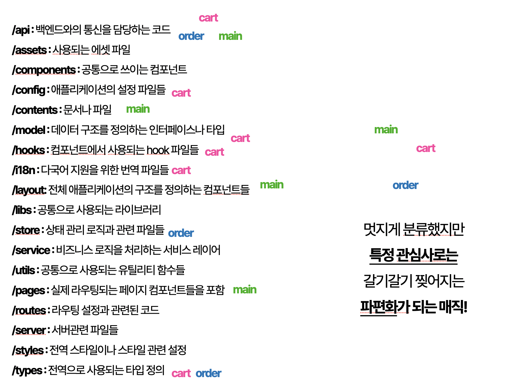

# FSD 폴더 구조와 장단점 알아보기💡

2025-05-27

**Tags:** #FSD #폴더구조

기존에는 React/Next에서 많이 사용되는 방식의 폴더 구조로,  https://frontend-fundamentals.com/code-quality/code/examples/code-directory.html 해당 Toss 블로그를 참조한 도메인 중심의 폴더 구조를 사용해왔다.

하지만 이런 구조는 개발이 진행될수록 특정 기능을 어떤 폴더로 분류해야할지 애매해진다는 단점이 있었다.

규모가 그리 크지 않은 프로젝트만 개발해왔음에도 파일 분리에 대한 이슈를 여러번 겪어와서, 어떤 폴더 구조가 좋을지에 대한 고민을 하고 있던 중에 이 글을 발견하게 됐다.

https://velog.io/@teo/separation-of-concerns-of-frontend

### 인용

---

`기존의 방식대로 분류하면 특정 관심사를 기준으로 했을 때는 오히려 파편화된다.`



## FSD(Feature-Sliced Design)

---

프론트엔드 아키텍처 방법론 중 하나로, 이는 애플리케이션을 기능(feature) 단위로 구조화하는 접근 방식이다.

FSD(Folder Structure Design 또는 Feature-Sliced Design)는 규모가 큰 프론트엔드 프로젝트에서 기능 중심(feature-first)으로 폴더를 구성하여 관심사의 분리(SoC)를 명확하게 하기 위한 설계 방식이다.

### FSD의 주요 계층 구조

---

1. `shared` - 공유 유틸리티, 라이브러리, UI 키트 등 재사용 가능한 코드
2. `entities` - 비즈니스 엔티티(사용자, 상품 등)의 모델과 로직
3. `features` - 특정 비즈니스 로직을 수행하는 기능들
4. `widgets` - 페이지에서 재사용되는 독립적인 블록들
5. `pages` - 라우팅 가능한 화면 단위
6. `processes` - 페이지 간 비즈니스 프로세스
7. `app` - 전역 설정, 스타일, 프로바이더 등

각 계층은 아래 계층만 import할 수 있고, 위 계층의 코드를 import할 수 없다는 규칙이 있다.

→ 따라서 의존성 관리가 용이하고,

→ 코드의 재사용성과 유지보수성을 높이는데 도움이 된다.

### 폴더 구조 예시

---

```
src/
├── app/                # 앱 초기 설정 (라우터, 전역 스타일, providers 등)
│   ├── providers/      # 리액트 컨텍스트, 테마 등 전역 상태 제공
│   ├── router/         # 라우팅 설정
│   └── App.tsx         # 최상위 컴포넌트
│
├── shared/             # 여러 곳에서 공통적으로 사용하는 것들
│   ├── ui/             # 재사용 가능한 UI 컴포넌트 (Button, Modal 등)
│   ├── lib/            # 헬퍼 함수, 유틸, 설정 파일 등
│   ├── config/         # 환경설정 파일 (api baseURL, constants 등)
│   ├── api/            # API 클라이언트, 공통 인터셉터 등
│   └── types/          # 전역 타입 정의
│
├── entities/           # 비즈니스 핵심 도메인 단위 (User, Article 등)
│   ├── user/
│   │   ├── model/      # 상태, actions, stores, types
│   │   ├── ui/         # user 관련 재사용 UI 컴포넌트
│   │   └── lib/        # 유저 관련 유틸
│   └── article/
│       ├── model/
│       ├── ui/
│       └── lib/
│
├── features/           # 독립적인 기능 단위 (로그인, 좋아요 등)
│   ├── login/
│   │   ├── model/      # 상태, 로직
│   │   ├── ui/         # 로그인 버튼, 폼
│   │   └── api/        # 로그인 요청
│   └── like/
│       ├── model/
│       ├── ui/
│       └── api/
│
├── pages/              # 라우트 단위 페이지
│   ├── HomePage/
│   │   ├── ui/         # 페이지 전용 컴포넌트
│   │   ├── model/
│   │   └── index.tsx   # 실제 라우팅되는 페이지 컴포넌트
│   └── ProfilePage/
│
└── widgets/            # 여러 엔티티/기능 조합으로 구성된 복합 UI
    ├── Header/
    │   ├── ui/
    │   └── model/
    └── Sidebar/
```

### **주요 개념 요약**

---

| **레이어** | **역할** |
| --- | --- |
| **app** | 앱 초기 설정, 전역 Provider, Router 등 |
| **shared** | 공통 UI, 유틸 함수, 설정, API 인스턴스 등 |
| **entities** | 핵심 비즈니스 객체(유저, 게시글 등)의 상태/뷰/유틸 |
| **features** | 유저 상호작용 기반 기능 단위(로그인, 댓글작성 등) |
| **widgets** | 여러 feature와 entity를 조합한 UI 블록(Header 등) |
| **pages** | 라우트에 대응되는 페이지 단위 컴포넌트 |

### 내가 생각하는 단점

---

폴더를 entity, feature, pages 등의 단위로 나누고, 그 안에 ui와 model, api 등으로 다시 나누게 되는데, 작은 프로젝트에서는 이러한 구조가 사용성 대비 많은 폴더를 가지게 되어 과하다고 느꼈다.

그리고 이 부분은 기존에 사용하던 DDD 방식과도 같은 문제인데, 폴더 구조를 나누다보면 기준을 어디에 두고 폴더를 분리해야 할지 애매해지는 지점이 발생한다.

### FSD 구조가 과하다고 느껴질 때는?

---

- DDD(도메인 주도 개발)

https://frontend-fundamentals.com/code-quality/code/examples/code-directory.html

[DDD 구조](https://www.notion.so/DDD-1ff413a1ee8180afa1f9dc022fb10782?pvs=21)